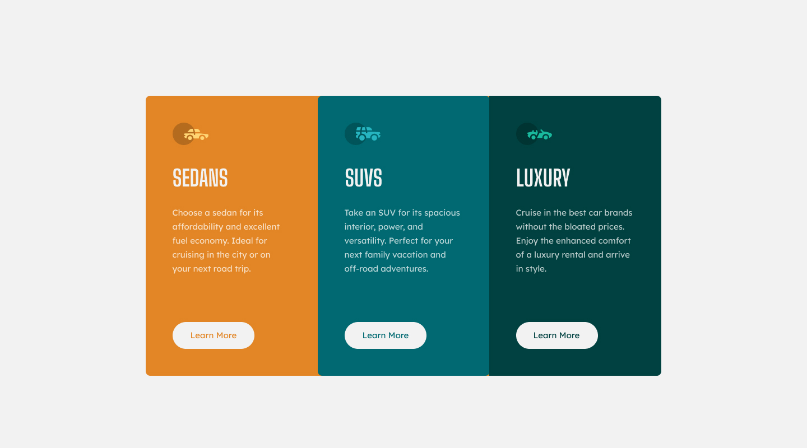

# Frontend Mentor - 3-column preview card component solution

This is a challenge from [Frontend Mentor](https://www.frontendmentor.io/). Coded by [me](https://www.frontendmentor.io/profile/Martin-K-Kamir)! 😁

Welcome to the repository for this project. Feel free to look around and expore! 😀

### Tools

- [React](https://reactjs.org/)
- [SCSS](https://sass-lang.com/)

### Development

This is my second react project and second frontend mentor solution. In this challenge i wanted to focus on maping cards.

### Links

- Live Site URL - [Link](#)
- Website - [Martin Kamír](https://martinkamir.com/)
- Frontend Mentor - [@Martin-K-Kamir](https://www.frontendmentor.io/profile/Martin-K-Kamir)
- Frontend Mentor Solution - [Solution link](#)

Happy coding! 😄